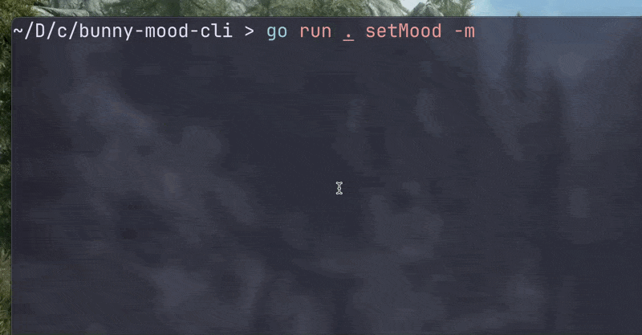

# 🐰 Bunny Mood CLI

A fun command-line application written in Go that displays an ASCII bunny based on your current mood.



---

## Features

* Built with **Go** and **Cobra**
* Change the bunny's mood using a simple command
* Supports multiple moods and aliases
* Lightweight and beginner-friendly CLI project

---

## Installation

Clone the repository:

```bash
git clone https://github.com/your-username/bunny-mood-cli.git
cd bunny-mood-cli
```

Install dependencies:

```bash
go mod tidy
```

---

## Usage

Run the application:

```bash
go run .
```

You should see:

```text
hello! try: go run . setMood -m happy
```

Set the bunny's mood:

```bash
go run . setMood -m happy
```

---

## Available Moods

| Mood     | Command                        |
| -------- | ------------------------------ |
| Happy    | `go run . setMood -m happy`    |
| Sad      | `go run . setMood -m sad`      |
| Tired    | `go run . setMood -m tired`    |
| Love     | `go run . setMood -m love`     |
| Rain     | `go run . setMood -m rain`     |
| Hungry   | `go run . setMood -m hungry`   |
| Angry    | `go run . setMood -m angry`    |
| Confused | `go run . setMood -m confused` |
| Sleepy   | `go run . setMood -m sleepy`   |
| Cool     | `go run . setMood -m cool`     |
| Shy      | `go run . setMood -m shy`      |
| Excited  | `go run . setMood -m excited`  |
| Sick     | `go run . setMood -m sick`     |

### Supported aliases

```text
love      → in love
rain      → in the rain
confused  → idk
```

---

## Examples

### Happy

```bash
go run . setMood -m happy
```

```text
Happy!

(\_/)
( ^_^)
/ >🌷<
```

---

### Excited

```bash
go run . setMood -m excited
```

```text
Excited!

(\_/)
( ^o^)
/ >✨<
```

---

### Invalid mood

```bash
go run . setMood -m potato
```

```text
Bunny is unsure of what you typed :( Try Again!

(\_/)
( •_•)?
/ > <\
```

---

## Project Structure

```text
.
├── main.go
├── go.mod
├── go.sum
├── README.md
└── assets
    └── bunny-mood-demo.gif
```

---

## Technologies Used

* Go
* Cobra CLI

---

## Why I Built This

This project was created to practice:

* Building command-line applications with Cobra
* Working with flags and subcommands
* Organizing Go projects
* Having a little fun with ASCII art

---

Made with Go and a slightly emotional bunny.
